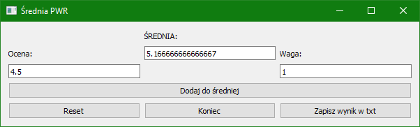

# PWR-Average-Calcularor
I created  Average number calculator. I made this because I wanted learned PyQt5 library and create something quick and simple. This aplication help me check my average grades on my univerity. I also made executable file from Python.

# How to install??

1. Just use git clone or download zip folder
2. Use pip to install PyQt5 

   >pip install PyQt5
   
3. Run 1_WindowResolution.py

# Project image

